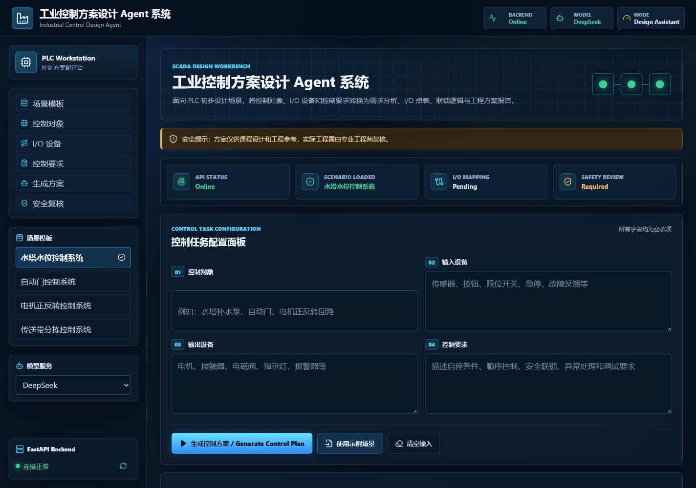
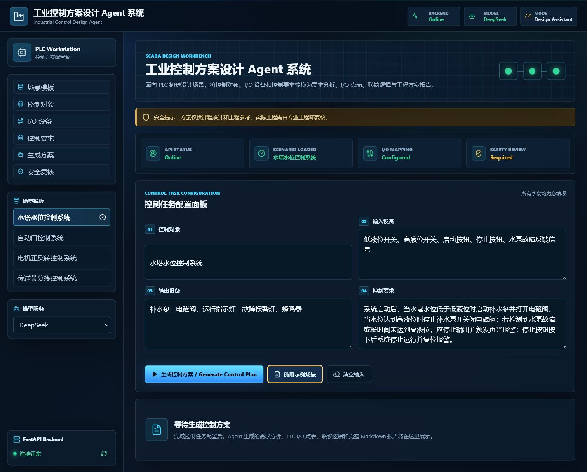
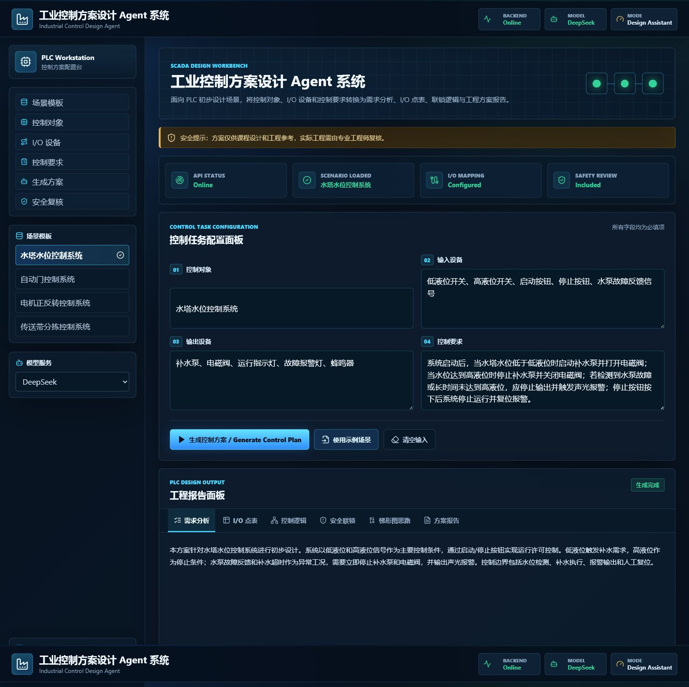
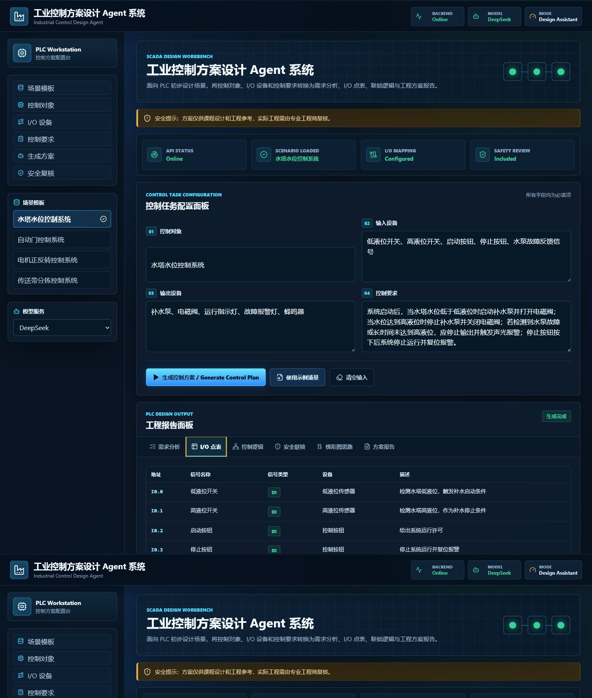
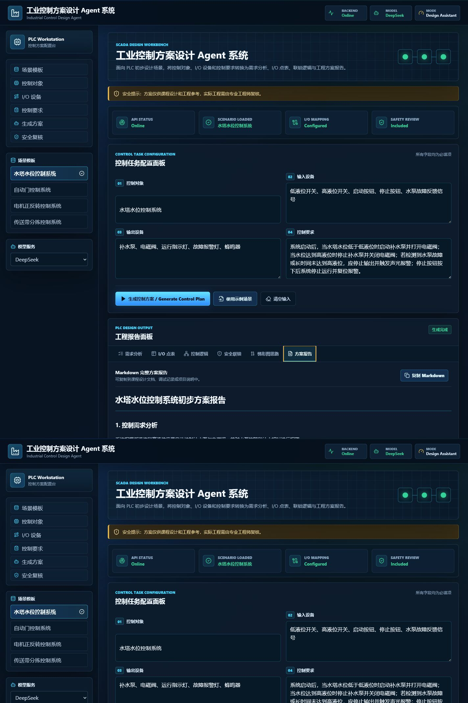
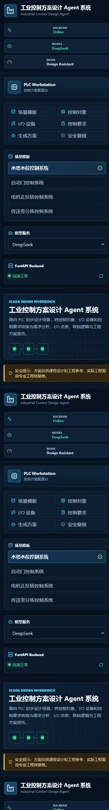

# 基于 React + FastAPI 的工业控制方案设计 Agent 系统

一个面向自动化控制系统方案设计场景的 AI Agent 项目。系统采用 React + FastAPI 前后端分离架构，前端负责控制任务输入和结果展示，后端负责接口协议、Agent Workflow 编排和 DeepSeek API 调用封装。

## 在线体验

- 前端在线地址：[https://industrial-control-agent.netlify.app](https://industrial-control-agent.netlify.app/)
- 后端 API 文档：[https://industrial-control-agent-backend.onrender.com/docs](https://industrial-control-agent-backend.onrender.com/docs)
- 后端健康检查：[https://industrial-control-agent-backend.onrender.com/health](https://industrial-control-agent-backend.onrender.com/health)

说明：后端部署在 Render Free，实例可能休眠，首次访问接口时可能需要等待几十秒。

## 项目简介

本项目面向自动化控制系统方案设计场景。用户输入控制对象、输入设备、输出设备和控制要求后，系统通过 FastAPI 后端调用大模型，生成结构化的工业控制方案内容：

- 控制需求分析
- PLC I/O 点表
- 控制逻辑
- 安全保护与报警建议
- PLC 梯形图设计思路
- Markdown 方案报告

项目重点展示 AI Agent 在工业控制方案设计辅助场景中的应用实现，包括 React 前端组件化开发、FastAPI RESTful API、Pydantic 协议建模、DeepSeek API 接入、Agent Workflow 编排和前后端分离部署。

## 技术栈

前端：

- React
- Vite
- JavaScript
- HTML
- CSS
- Axios / API 请求封装

后端：

- FastAPI
- Python
- Pydantic
- OpenAI-compatible API
- DeepSeek API

工程与部署：

- Git / GitHub
- Render
- Netlify
- 环境变量管理
- CORS
- pytest
- Fake LLM 测试替身

## 系统架构

```text
React 前端
  ├─ 控制任务输入
  ├─ 示例场景选择
  ├─ 后端连接状态展示
  ├─ 结果 Tabs
  ├─ PLC I/O 表格
  └─ Markdown 报告展示与复制
        |
        | VITE_API_BASE_URL
        v
FastAPI 后端
  ├─ 请求 / 响应协议
  ├─ Agent Workflow
  ├─ 大模型调用封装
  ├─ 错误处理
  └─ CORS 配置
        |
        | 后端环境变量
        v
DeepSeek API
```

架构说明：

- React 前端负责控制任务输入、示例场景选择、状态展示、结果 Tabs、PLC I/O 表格和 Markdown 报告展示。
- FastAPI 后端负责接口协议、Agent 工作流、大模型调用封装、错误处理和 CORS。
- DeepSeek API Key 通过后端环境变量管理。
- 前端通过 `VITE_API_BASE_URL` 调用后端。
- 后端通过 `FRONTEND_ORIGIN` 配置跨域来源。

## 核心功能

- 示例场景选择
- 控制任务输入
- 工业控制方案生成
- PLC I/O 点表生成
- 控制逻辑生成
- 安全保护与报警建议
- 梯形图设计思路输出
- Markdown 报告生成与复制
- 后端连接状态显示
- 基础响应式适配

## 项目亮点

1. React 组件化开发：拆分 Header、Sidebar、表单、状态展示、结果 Tabs 和报告预览等模块。
2. FastAPI RESTful API：提供清晰的后端接口，支持前后端分离调用。
3. Pydantic 请求 / 响应协议：定义稳定的数据结构，便于前端展示和后续维护。
4. Agent Workflow：围绕工业控制方案生成流程组织需求分析、I/O 点表、控制逻辑、安全保护、梯形图思路和报告汇总。
5. DeepSeek API 接入：使用 OpenAI-compatible API 封装大模型调用。
6. PLC I/O 点表结构化输出：支持地址、信号名称、信号类型、设备和描述等字段展示。
7. 错误处理：后端统一处理接口异常，前端展示清晰的请求状态和错误提示。
8. Fake LLM 测试替身：用于接口响应字段和前端展示流程的回归测试。
9. 前后端分离部署：前端部署到 Netlify，后端部署到 Render。
10. 环境变量管理：后端管理模型 API Key，前端通过环境变量配置后端地址。

## 接口说明

| 方法 | 路径 | 用途 |
| --- | --- | --- |
| `GET` | `/health` | 后端健康检查，返回服务状态。 |
| `GET` | `/examples` | 获取内置自动化控制示例场景。 |
| `POST` | `/generate` | 根据控制对象、输入设备、输出设备和控制要求生成控制方案。 |
| `POST` | `/optimize` | 根据优化要求对已有 Markdown 方案进行优化。 |

## 本地运行方式

### 后端

```bash
cd backend
pip install -r requirements.txt
uvicorn main:app --reload --port 8000
```

后端默认本地地址：

```text
http://localhost:8000
```

### 前端

```bash
cd frontend
npm install
npm run dev
```

前端默认本地地址：

```text
http://localhost:5173
```

### 环境变量

后端：

- `DEEPSEEK_API_KEY`：DeepSeek API Key，配置在后端运行环境中。
- `FRONTEND_ORIGIN`：允许跨域访问后端的前端地址。

前端：

- `VITE_API_BASE_URL`：FastAPI 后端地址，例如本地 `http://localhost:8000` 或线上 Render 地址。

## 部署说明

### 后端 Render

- Root Directory: `backend`
- Build Command: `pip install -r requirements.txt`
- Start Command: `uvicorn main:app --host 0.0.0.0 --port $PORT`
- Runtime: Python 3.11.9
- Environment Variables:
  - `DEEPSEEK_API_KEY`
  - `FRONTEND_ORIGIN`

### 前端 Netlify

- Base Directory: `frontend`
- Build Command: `npm run build`
- Publish Directory: `dist`
- Environment Variable:
  - `VITE_API_BASE_URL`

当前线上前端部署在 Netlify Free，后端部署在 Render Free。

## 截图展示

### 首页与状态面板

展示前端首页、后端连接状态、示例场景区域和控制任务输入区。



### 示例场景填充

展示选择“水塔水位控制系统”示例后，控制对象、输入设备、输出设备和控制要求已自动填充。



### Agent 方案生成结果

展示生成后的控制需求分析、结果 Tabs 和状态提示。



### PLC I/O 点表

展示 PLC I/O 点表，包括地址、信号名称、信号类型、设备和描述。



### Markdown 方案报告

展示 Markdown 完整方案报告预览和复制报告入口。



### 移动端布局

展示 390px 左右宽度下的响应式页面布局。


