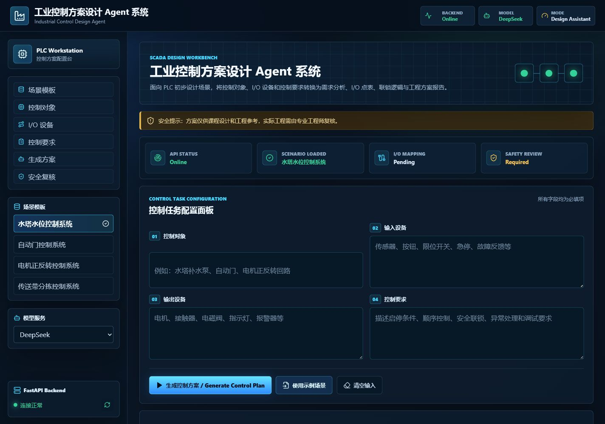
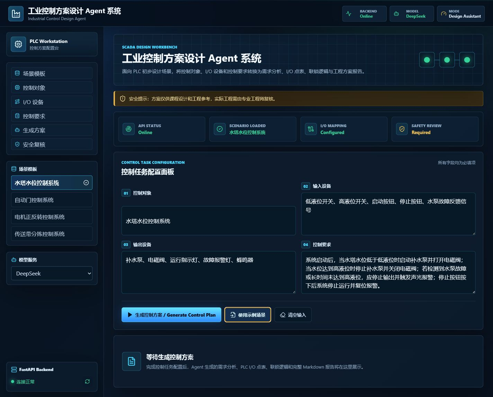
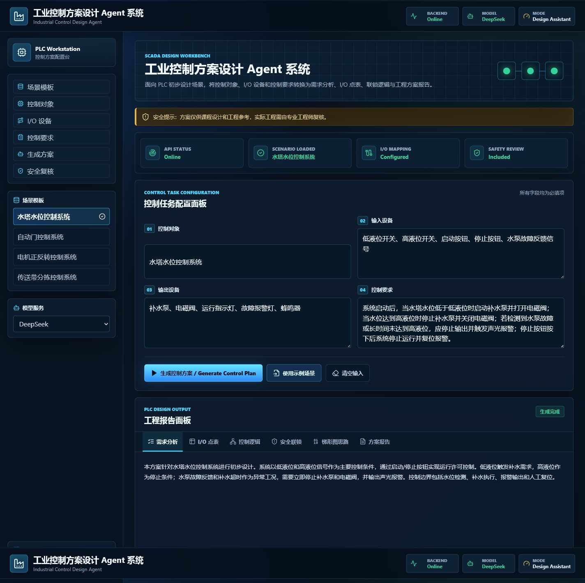
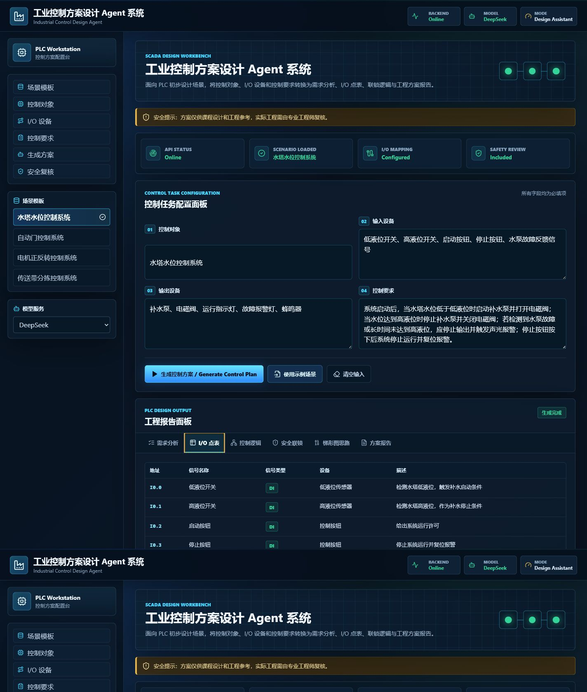
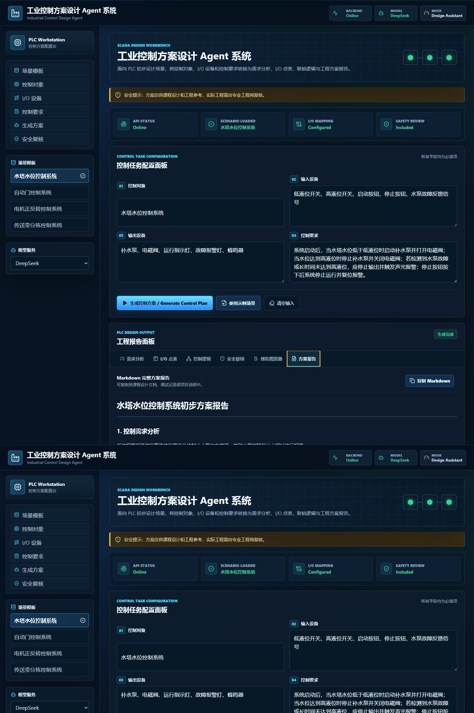
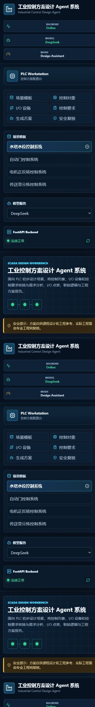
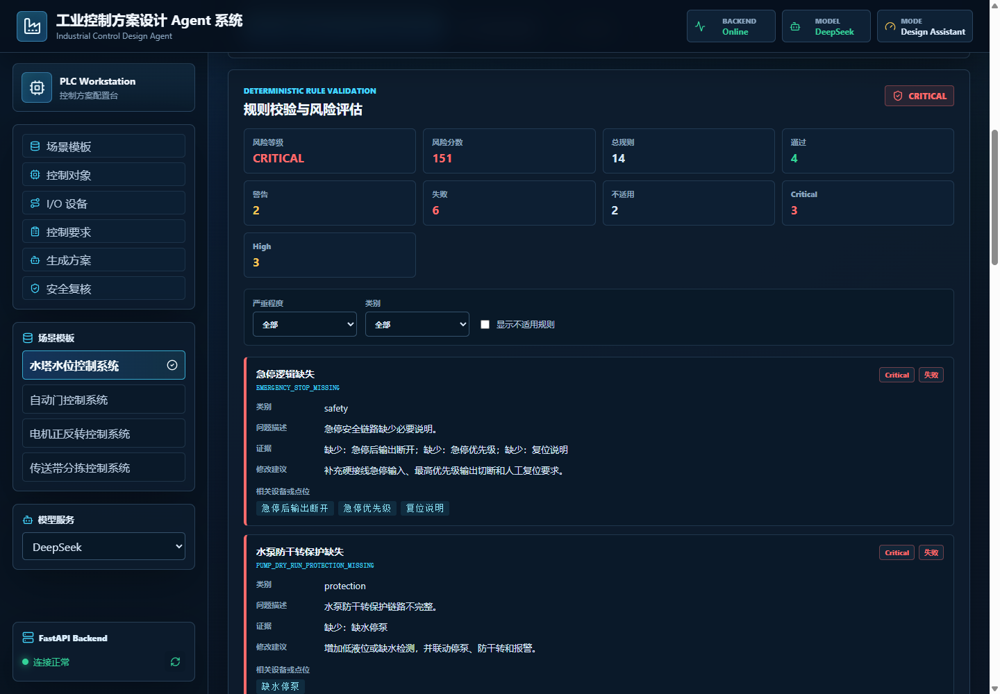
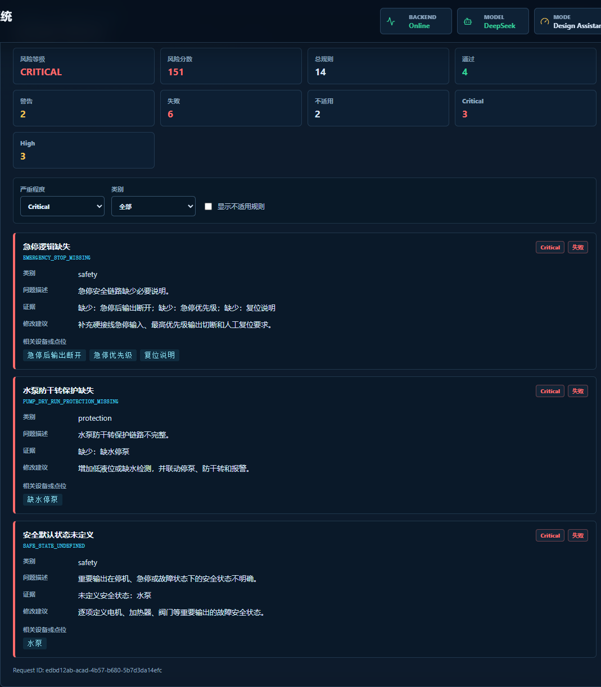
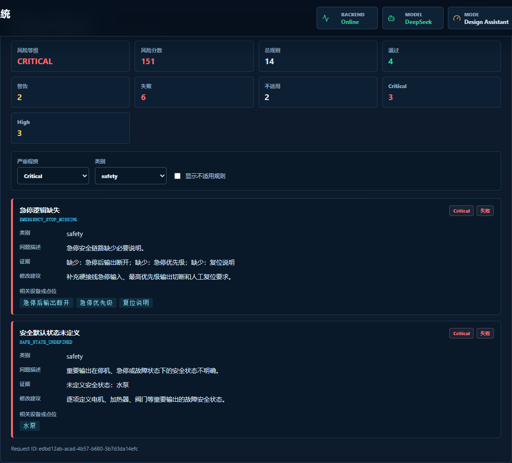
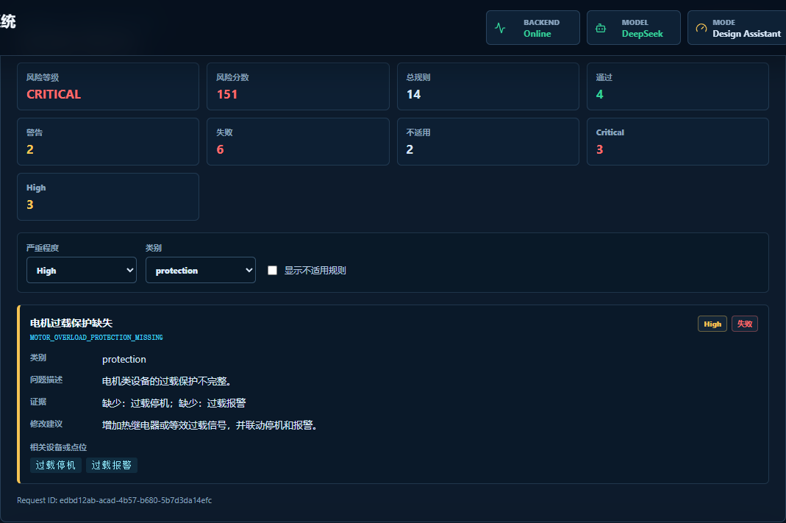

# 基于大模型的工业控制方案设计 Agent 平台

一个面向工业自动化控制方案设计场景的 AI Agent 项目。系统采用 React + FastAPI 前后端分离架构，前端负责控制任务输入和结果展示，后端负责接口协议、Agent Workflow 编排、链路观测和 OpenRouter Ox Alpha API 调用封装。

## 在线体验

- 前端在线地址：[https://industrial-control-agent.netlify.app](https://industrial-control-agent.netlify.app/)
- 后端服务基地址：[https://industrial-control-agent-backend.onrender.com](https://industrial-control-agent-backend.onrender.com)
- 后端 API 文档：[https://industrial-control-agent-backend.onrender.com/docs](https://industrial-control-agent-backend.onrender.com/docs)
- 后端健康检查：[https://industrial-control-agent-backend.onrender.com/health](https://industrial-control-agent-backend.onrender.com/health)

说明：后端部署在 Render Free，实例可能休眠，首次访问接口时可能需要等待几十秒。

## 项目简介

本项目面向工业自动化控制方案设计场景。用户输入控制对象、输入设备、输出设备和控制要求后，系统通过 FastAPI 后端执行 Agent Workflow，生成结构化的工业控制方案：

- 控制需求分析
- PLC I/O 点表
- 控制逻辑
- 安全联锁与报警建议
- PLC 梯形图设计思路
- Markdown 方案报告

项目重点展示 AI Agent 在工业控制方案设计辅助场景中的应用实现，包括 React 前端组件化开发、FastAPI RESTful API、Pydantic 协议建模、Prompt Engineering、OpenRouter Ox Alpha 接入、Agent Workflow 编排、请求链路观测和前后端分离部署。

## 技术栈

前端：

- React
- Vite
- JavaScript
- HTML
- CSS
- Fetch API / API 请求封装
- React Markdown

后端：

- FastAPI
- Python 3.11
- Pydantic
- OpenAI Python SDK
- OpenRouter API（固定使用 `stealth/ox-alpha`）
- Prompt Engineering

工程与部署：

- Git / GitHub
- pytest
- Fake LLM 测试替身
- GitHub Actions
- CORS
- 环境变量管理
- Render
- Netlify

## 系统架构

```text
React 前端
  ├─ 控制任务输入
  ├─ 示例场景选择
  ├─ 后端连接状态展示
  ├─ 结果 Tabs
  ├─ PLC I/O 表格
  └─ Markdown 报告展示与复制
        |
        | VITE_API_BASE_URL
        v
FastAPI 后端
  ├─ 请求 / 响应协议
  ├─ Agent Workflow
  ├─ 大模型调用封装
  ├─ 错误处理
  └─ CORS 配置
        |
        | 后端环境变量
        v
OpenRouter Ox Alpha API
```

架构说明：

- React 前端负责控制任务输入、示例场景选择、状态展示、结果 Tabs、PLC I/O 表格和 Markdown 报告展示。
- FastAPI 后端负责接口协议、Agent 工作流、大模型调用封装、错误处理和 CORS。
- OpenRouter API Key 仅通过后端 `OPENROUTER_API_KEY` 环境变量管理。
- 前端通过 `VITE_API_BASE_URL` 调用后端。
- 后端通过 `FRONTEND_ORIGIN` 配置跨域来源。

## 核心功能

- 示例场景选择
- 控制任务输入
- 工业控制方案生成
- PLC I/O 点表生成
- 控制逻辑生成
- 安全联锁与报警建议
- 梯形图设计思路输出
- Markdown 报告生成、安全复核门禁与受控复制
- 后端连接状态显示
- 方案优化、变更摘要与前后版本对比
- 确定性规则校验、风险评分与前端风险面板
- 友好错误提示与 Request ID 展示

## Agent Workflow

控制方案生成链路如下：

```text
POST /generate
  → 生成或透传 X-Request-ID
  → Pydantic 请求校验
  → 构造工业控制 Prompt
  → 调用模型并解析严格 JSON
  → 校验需求分析
  → 校验 PLC I/O 点表
  → 校验控制逻辑、安全设计和梯形图思路
  → 汇总 Markdown 方案报告
  → 执行确定性工业控制规则校验
  → 计算风险分数并附加 validation_report
  → 返回结构化响应
```

生成流程通过一次模型调用取得完整结构化结果，再由后端逐步解析、边界校验和组装。模型请求启用 JSON Object 响应格式、输出 token 上限、总响应字符上限、I/O 行数及字段长度限制；用户内容以不可信 JSON 数据区传入。规则校验在结构化方案生成完成后本地执行，不依赖 LLM。`/optimize` 使用相同的请求追踪与错误处理机制，对已有 Markdown 方案执行优化、返回变更摘要，并对可可靠判断的文本规则再次校验。每个 Workflow 步骤都会记录成功或失败状态及执行耗时。

## 工业控制规则校验与风险评估

规则校验不是大模型对方案的再次解读，也不会发起额外模型调用；它在 Agent 生成结构化方案后，由后端以固定顺序执行 14 条确定性规则。规则优先使用结构化 I/O 点表，文本字段采用集中维护的中英文关键词、别名、句段边界和否定语义策略。无法可靠判断的规则返回 `not_applicable`，单条规则异常会转换为脱敏的稳定结果，不会让方案生成接口失败。

校验覆盖 I/O 地址、名称和类型，启停、急停、过载、正反转互锁、执行器反馈、报警覆盖、水泵防干转、动作超时、自动/手动模式互锁、安全默认状态及 I/O 表完整性。报告输出风险分数、风险等级、命中证据、修改建议和相关设备或点位；即使存在 critical 风险，接口仍会返回原方案及 `validation_report`，由调用方进行工程复核。

| Rule ID | 规则 | 类别 | 严重程度 |
| --- | --- | --- | --- |
| `IO_DUPLICATE_ADDRESS` | I/O 地址重复 | io | high |
| `IO_DUPLICATE_NAME` | I/O 点位名称重复 | io | medium |
| `IO_TYPE_MISMATCH` | 输入输出类型不匹配 | io | high |
| `START_STOP_INCOMPLETE` | 启停控制不完整 | control | high |
| `EMERGENCY_STOP_MISSING` | 急停逻辑缺失 | safety | critical |
| `MOTOR_OVERLOAD_PROTECTION_MISSING` | 电机过载保护缺失 | protection | high |
| `MUTUAL_INTERLOCK_MISSING` | 互锁保护缺失 | interlock | critical |
| `ACTUATOR_FEEDBACK_MISSING` | 执行器反馈缺失 | feedback | medium |
| `ALARM_COVERAGE_INCOMPLETE` | 报警覆盖不足 | alarm | medium |
| `PUMP_DRY_RUN_PROTECTION_MISSING` | 水泵防干转保护缺失 | protection | critical |
| `ACTION_TIMEOUT_PROTECTION_MISSING` | 动作超时保护缺失 | protection | high |
| `MODE_INTERLOCK_MISSING` | 自动/手动模式互锁缺失 | interlock | high |
| `SAFE_STATE_UNDEFINED` | 安全默认状态未定义 | safety | critical |
| `IO_TABLE_INCOMPLETE` | I/O 点表为空或结构不完整 | io | high |

仅 `warning` 和 `failed` 结果计分，同一 `rule_id` 最多计分一次；`passed` 与 `not_applicable` 不计分。

| 严重程度 | 权重 |
| --- | ---: |
| critical | 30 |
| high | 15 |
| medium | 8 |
| low | 3 |
| info | 0 |

| 风险分数 | 风险等级 |
| --- | --- |
| 0–9 | low |
| 10–24 | medium |
| 25–49 | high |
| 50 及以上 | critical |

当校验引擎整体不可用时，报告使用 `validation_status=unavailable`、`risk_level=unknown` 和 `risk_score=0`，同时将规则统计置空；此时的零分表示“未完成风险评估”，不表示低风险。单条规则异常则返回 `partial`，并继续执行其他规则。

`/generate` 和 `/optimize` 在保留原有字段的基础上附加 `validation_report`、`safety_gate`、`plan_id`、`content_hash` 和创建时间。每次生成或优化都会创建不可变方案版本；优化版本通过 `parent_plan_id` 关联父版本，且不会继承旧版本审批。

方案和审批在本地/测试环境默认写入 SQLite，生产环境强制使用 PostgreSQL。数据库模式由 Alembic 版本化管理；生产实例不会自动改表，启动时发现迁移版本落后会直接失败。生产身份由外部 OIDC 提供商负责，后端使用 JWKS 验证 JWT 签名，并强制校验 `issuer`、`audience`、`exp`、`iat` 和 `sub`。审批人标识与姓名只从已验签 claims 获取，不再接受页面填写或共享审批令牌。

RBAC 包含 `designer`、`reviewer` 和 `admin`：设计人员负责生成、优化和访问自己的方案；审批人员可以查看并审批方案；管理员可以查询全局审计记录。即使同一账号同时拥有设计和审批角色，也不能审批自己创建的方案。审批记录继续绑定方案 ID 与 SHA-256 内容哈希。

方案生成、优化、批准、驳回、拒绝导出和成功导出都会写入追加式审计表。生产审计链使用带密钥 ID 的 HMAC-SHA256，数据库触发器拒绝更新或删除审计事件，审计查询会重新验证整条链；高频 readiness 只验证链头，避免事件增长后产生无界扫描。每条审计事件与 Outbox 投递记录在同一个数据库事务中提交，再由独立 worker 以事件 ID 幂等投递到外部 SIEM/WORM 接收端；业务事务回滚时不会留下孤立审计或 Outbox。页面仍会展示方案以供审阅，因此受控导出约束的是系统提供的正式复制和下载路径，不是 DRM。

写接口支持 `Idempotency-Key`。相同用户、操作和请求体的重复调用返回首次创建的资源；复用同一 key 发送不同请求会返回 `409 IDEMPOTENCY_CONFLICT`，执行中的重复调用返回带 `Retry-After` 的 `409`。审批通过方案行版本实现乐观并发控制；导出授权检查、导出审计与审批状态读取在同一个事务中完成，避免审批状态变化期间的检查/使用竞态。

SQLite 仅用于本地开发和自动化测试。生产 PostgreSQL 使用连接池、连接存活检查和事务边界，支持多 Worker/多实例。迁移、PITR、逻辑备份、隔离恢复演练和密钥轮换步骤见 [`docs/database-recovery.md`](docs/database-recovery.md)。

## 链路稳定性与测试

### 请求追踪与日志

- 客户端传入 `X-Request-ID` 时直接透传；未传入时自动生成 UUID。
- `request_id` 贯穿 API、Agent Workflow、LLM 重试日志和错误响应，响应头同时返回 `X-Request-ID`。
- Workflow 使用应用自有的 INFO 级 JSON logger 记录 `request_id`、`workflow_name`、`step_name`、`status`、`duration_ms`、`retry_count` 和 `error_type`，不依赖 ASGI 服务器的默认日志级别。
- 每个 Workflow 步骤记录执行耗时，便于定位慢步骤和失败位置。

### 超时、重试与错误处理

- 单次模型 HTTP 尝试的网络阶段超时默认设为 60 秒，包含重试和退避在内的应用层结果预算为 90 秒；每次重试都会按剩余预算缩短网络超时，预算后返回的成功或错误结果统一按超时拒绝。
- OpenAI SDK 内部重试已显式关闭，统一由应用层最多重试 2 次，因此一个业务请求最多发起 3 次底层模型调用，不会产生双层重试放大。
- 超时、连接错误、HTTP 408/409/429 和服务端临时错误使用带抖动的指数退避；上游返回有效 `Retry-After` 时优先遵守，但不会等待超过总预算。
- 前端通过 `/jobs/generate` 与 `/jobs/optimize` 提交持久任务，再轮询任务状态；页面刷新或 API 进程重启不会丢失已入队任务，付费模型调用只由独立 worker 发起。
- 后端统一使用 `SkillExecutionError`、`LLMTimeoutError`、`LLMResponseFormatError` 和 `WorkflowExecutionError` 表达可预期的链路异常。
- API 返回稳定、脱敏的错误结构；前端按错误类型显示友好提示，并在可用时展示 Request ID。

模型 worker 使用数据库租约领取任务，并在执行期间续租；租约过期后其他 worker 可恢复执行。每次领取都会递增 fencing token，旧 worker 的迟到结果无法覆盖新 worker。运行中取消采用协作式语义：当前同步模型 HTTP 调用返回后丢弃结果且不创建方案；若需要立即中断底层网络 I/O，仍需迁移到支持取消的异步模型客户端。

### 模型接口流量保护

`/generate` 与 `/optimize` 共享同一组保护：

- 默认最多同时执行 2 个模型请求，容量已满时返回 `503 API_CAPACITY_EXCEEDED` 和短暂的 `Retry-After`。
- 默认每 60 秒最多接受 12 个模型请求，每个客户端最多接受 4 个，超限时返回 `429 API_RATE_LIMIT_EXCEEDED` 和 `Retry-After`。
- 默认每日最多接受 200 个模型请求，耗尽后返回 `429 API_DAILY_BUDGET_EXCEEDED`。
- 可选 Bearer Token 认证在 `MODEL_API_AUTH_REQUIRED=true` 时启用；未同时配置服务端 `MODEL_API_ACCESS_TOKEN` 时应用会拒绝启动，避免认证配置意外失效。
- 认证、限流或容量检查拒绝的请求不会创建或调用模型客户端。
- `/health`、`/ready`、`/examples` 和 CORS 预检保持公开，不占用模型请求额度。

未配置 `MODEL_API_REDIS_URL` 时限制器针对单个 ASGI 进程。配置 Redis 后，分钟总额度、客户端额度、每日预算和并发租约通过原子脚本在多 Worker/多实例之间共享；Redis 配置存在但连接失败时应用拒绝启动，避免静默退回非全局保护。

客户端额度使用 ASGI 服务器在可信代理配置下解析得到的 `request.client.host`，业务代码不会直接信任任意 `X-Forwarded-For`。部署到新的反向代理平台时，应先确认其可信代理配置；即使客户端地址无法区分，单进程总额度和并发上限仍会继续生效。

### 自动化回归

后端测试使用 Fake LLM、Mock 和固定方案数据覆盖正常 Workflow、API 协议、请求标识、错误清洗、模型超时总预算、单层有限重试、`Retry-After`、响应格式异常、模型接口认证、限流、并发租约、14 条规则、评分边界、异常隔离，以及多轮独立规则审查形成的两组共 20 个固定工业控制场景，不会发起真实模型调用。

| 验证项 | 命令 | 当前结果 |
| --- | --- | --- |
| 后端回归测试 | `python -m pytest backend\tests -q` | 335 passed，1 个 PostgreSQL CI 测试在本地跳过 |
| 前端组件测试 | `npm.cmd run test` | 20 passed |
| 前端生产构建 | `npm.cmd run build` | 通过 |

GitHub Actions CI 在以下场景自动触发：

- push 到 `main`
- 创建或更新面向 `main` 的 Pull Request
- 手动运行 `workflow_dispatch`

CI 的 `Backend Tests` 任务执行 PostgreSQL 迁移、Python 语法检查、覆盖率门槛和后端回归测试；`Frontend Build` 任务执行 `npm ci`、ESLint、前端组件测试和 Vite 生产构建。

## 项目亮点

1. React 组件化开发：拆分 Header、Sidebar、表单、状态展示、结果 Tabs 和报告预览等模块。
2. FastAPI RESTful API：提供清晰的后端接口，支持前后端分离调用。
3. Pydantic 请求 / 响应协议：定义稳定的数据结构，便于前端展示和后续维护。
4. Agent Workflow：围绕工业控制方案生成流程组织需求分析、I/O 点表、控制逻辑、安全保护、梯形图思路和报告汇总。
5. OpenRouter Ox Alpha 接入：使用 OpenAI-compatible API，服务端固定模型 ID 为 `stealth/ox-alpha`。
6. PLC I/O 点表结构化输出：支持地址、信号名称、信号类型、设备和描述等字段展示。
7. 链路可观测性：使用 Request ID、结构化日志和步骤耗时串联 API、Workflow 与错误响应。
8. 弹性模型调用：使用单层有限重试、应用层结果预算、带抖动退避和 `Retry-After`，并统一清洗异常信息。
9. Fake LLM 测试替身：用于 Workflow、接口协议和异常链路的自动化回归。
10. GitHub Actions CI：自动执行后端语法检查、pytest、前端依赖安装和生产构建。
11. 前后端分离部署：前端部署到 Netlify，后端部署到 Render。

## API 接口

| 方法 | 路径 | 用途 |
| --- | --- | --- |
| `GET` | `/health` | 后端健康检查，返回服务状态。 |
| `GET` | `/ready` | 检查模型配置、流量保护、规则引擎和方案存储是否就绪。 |
| `GET` | `/auth/me` | 返回当前已验证用户和应用角色。 |
| `GET` | `/examples` | 获取内置自动化控制示例场景。 |
| `POST` | `/jobs/generate` | 幂等创建异步方案生成任务并返回 `202`。 |
| `POST` | `/jobs/optimize` | 幂等创建异步方案优化任务并返回 `202`。 |
| `GET` | `/jobs` | 查询当前用户的模型任务；管理员可查询全部。 |
| `GET` | `/jobs/{job_id}` | 查询持久任务状态、进度、尝试次数与最终结果。 |
| `POST` | `/jobs/{job_id}/cancel` | 取消排队任务或请求取消运行中任务。 |
| `POST` | `/generate` | 根据控制对象、输入设备、输出设备和控制要求生成控制方案。 |
| `POST` | `/optimize` | 根据优化要求对已有 Markdown 方案进行优化。 |
| `GET` | `/plans` | 按当前角色返回自己的方案或审批收件箱。 |
| `GET` | `/plans/{plan_id}` | 查询持久化方案、内容哈希及当前导出状态。 |
| `POST` | `/plans/{plan_id}/reviews` | 由 `reviewer/admin` 使用已验证身份记录批准或驳回。 |
| `GET` | `/plans/{plan_id}/export` | 在后端复核审批状态后导出 Markdown。 |
| `GET` | `/plans/{plan_id}/audit` | 查询有权访问方案的审计记录并验证哈希链。 |
| `GET` | `/audit/events` | 由 `admin` 查询全局审计记录并验证哈希链。 |

身份和授权失败返回 `401 AUTHENTICATION_REQUIRED`、`403 AUTHORIZATION_DENIED` 或 `403 SELF_REVIEW_DENIED`。模型接口还可能返回 `429 API_RATE_LIMIT_EXCEEDED`、`429 API_DAILY_BUDGET_EXCEEDED` 或 `503 API_CAPACITY_EXCEEDED`；审批和导出链路可能返回 `403 PLAN_REVIEW_REQUIRED`、`404 PLAN_NOT_FOUND` 或 `409 PLAN_VERSION_CONFLICT`。所有错误继续使用统一、脱敏的错误结构，并在响应头和响应体中携带相同的 Request ID。

## 本地运行方式

### 后端

```bash
cd backend
pip install -r requirements.txt
uvicorn main:app --reload --port 8000
```

另开一个终端运行模型任务 worker：

```bash
python -m backend.model_job_worker
```

后端默认本地地址：

```text
http://localhost:8000
```

### 前端

```bash
cd frontend
npm ci
npm run dev
```

前端默认本地地址：

```text
http://localhost:5173
```

## 环境变量

后端：

- `OPENROUTER_API_KEY`：唯一必填的模型密钥，仅配置在后端运行环境中；模型与 API 地址均已固定。
- `APP_ENV`：运行环境；缺省按 `production` 处理并强制要求 `AUTH_MODE=oidc`。本地免登录必须显式设为 `development`。
- `FRONTEND_ORIGIN`：允许跨域访问后端的前端地址。
- `LOG_LEVEL`：应用结构化日志级别，默认 `INFO`。
- `DATABASE_URL`：生产 PostgreSQL 连接串；`postgres://` 和 `postgresql://` 会规范化为 psycopg 3 驱动。本地留空时由 `PLAN_STORAGE_PATH` 生成 SQLite URL。
- `DATABASE_AUTO_MIGRATE`：仅本地 SQLite 可设为 `true`；生产必须为 `false` 并在发布阶段运行 `python -m alembic upgrade head`。
- `DATABASE_POOL_SIZE` / `DATABASE_MAX_OVERFLOW`：PostgreSQL 连接池基础大小和临时溢出上限，默认 `5` / `10`。
- `DATABASE_SSLMODE`：PostgreSQL TLS 模式；生产只接受 `require`、`verify-ca` 或 `verify-full`。
- `DATABASE_CONNECT_TIMEOUT_SECONDS`：数据库建连超时，默认 `5`，最大 `30`。
- `AUTH_MODE`：`disabled`、`oidc` 或仅供自动化测试使用的 `hs256`；生产环境必须为 `oidc`。
- `AUTH_DISABLED_ROLES`：仅在 `AUTH_MODE=disabled` 时为本地或演示身份授予的角色；公开演示建议只配置 `designer`。
- `AUTH_ISSUER`：访问令牌必须精确匹配的 OIDC issuer。
- `AUTH_AUDIENCE`：本 API 的 audience。
- `AUTH_JWKS_URL`：OIDC 公钥地址；OIDC 模式下必须使用 HTTPS。
- `AUTH_ALGORITHMS`：允许的非对称 JWT 算法列表，默认 `RS256`。
- `AUTH_ROLES_CLAIM`：角色 claim 或点分嵌套路径，例如 `roles`、`realm_access.roles`。
- `AUTH_NAME_CLAIM`：审批与审计中显示的姓名 claim，默认 `name`。
- `AUTH_CLOCK_SKEW_SECONDS`：令牌时钟偏差容忍值，默认 `30`，最大 `300`。
- `AUDIT_SIGNING_KEYS_JSON`：审计 HMAC 历史密钥的 JSON 对象；生产必须配置，值只能存在服务端密钥管理系统。
- `AUDIT_ACTIVE_KEY_ID`：新审计事件使用的密钥 ID，必须存在于签名密钥对象中。
- `AUDIT_SINK_REQUIRED`：生产默认 `true`；启用时要求 HTTPS `AUDIT_SINK_URL`。
- `AUDIT_SINK_URL` / `AUDIT_SINK_TOKEN`：外部 SIEM/WORM 接收地址和可选服务端凭证。
- `AUDIT_OUTBOX_MAX_PENDING`：readiness 允许的未投递审计事件上限，默认 `10000`。
- `AUDIT_WORKER_MAX_STALENESS_SECONDS`：readiness 允许的审计 worker 心跳最大间隔，默认 `30` 秒。
- `MODEL_JOB_WORKER_REQUIRED`：是否要求 `/ready` 检查模型 worker 心跳；生产默认 `true`。
- `MODEL_JOB_WORKER_MAX_STALENESS_SECONDS`：readiness 允许的模型 worker 心跳最大间隔，默认 `30` 秒。
- `MODEL_JOB_QUEUE_MAX_PENDING`：readiness 允许的非终态模型任务上限，默认 `1000`。
- `MODEL_JOB_LEASE_SECONDS`：worker 执行租约时长，默认 `180` 秒，执行期间会自动续租。
- `MODEL_JOB_MAX_ATTEMPTS`：临时失败或租约恢复的最大任务尝试次数，默认 `3`。
- `MODEL_API_MAX_CONCURRENCY`：单进程模型请求并发上限，默认 `2`。
- `MODEL_API_GLOBAL_REQUESTS`：单进程时间窗口内的总请求额度，默认 `12`。
- `MODEL_API_CLIENT_REQUESTS`：单客户端时间窗口内的请求额度，默认 `4`。
- `MODEL_API_DAILY_REQUESTS`：每日请求预算，默认 `200`。
- `MODEL_API_RATE_WINDOW_SECONDS`：限流时间窗口秒数，默认 `60`。
- `MODEL_API_AUTH_REQUIRED`：是否要求模型接口携带 Bearer Token，默认 `false`。
- `MODEL_API_ACCESS_TOKEN`：私有模式使用的服务端访问令牌；仅在可信服务端环境配置。
- `MODEL_API_REDIS_URL`：可选 Redis 连接地址；配置后启用跨进程、跨实例的全局保护。
- `MODEL_API_REDIS_KEY_PREFIX`：Redis 键前缀，默认 `industrial-control-agent`。
- `PLAN_STORAGE_PATH`：仅本地 SQLite 使用的路径，默认 `backend/data/plans.db`。

> [Ox Alpha](https://openrouter.ai/stealth/ox-alpha) 是 OpenRouter 上的匿名供应商预览模型。供应商会保留提示词和输出，因此该接入仅适合非生产演示，不应提交工业敏感数据、真实设备参数或生产控制策略。

前端：

- `VITE_API_BASE_URL`：FastAPI 后端地址，例如本地 `http://localhost:8000` 或线上 Render 地址。
- `VITE_OIDC_AUTHORITY`：OIDC Provider Authority。
- `VITE_OIDC_CLIENT_ID`：为 SPA 注册的 Public Client ID，必须启用 Authorization Code + PKCE。
- `VITE_OIDC_REDIRECT_URI`：登录回调地址。
- `VITE_OIDC_POST_LOGOUT_REDIRECT_URI`：退出登录后的回调地址。
- `VITE_OIDC_SCOPE`：默认 `openid profile`；角色应包含在访问令牌中。

任何 `VITE_*` 环境变量都会进入公开的浏览器构建产物，因此只能放公开的 OIDC 客户端配置，不能包含 Client Secret。前端使用 Authorization Code + PKCE，并由 `oidc-client-ts` 在会话存储中管理用户会话；后端从不信任前端提供的姓名或角色。启用 OIDC 后必须保持旧的 `MODEL_API_AUTH_REQUIRED=false`，应用会拒绝同时启用两套 Bearer 认证。

## 在线部署

### 后端 Render

- Root Directory: 项目根目录
- Build Command: `pip install -r backend/requirements.txt`
- Pre-Deploy Command: `python -m alembic upgrade head`
- Web Start Command: `uvicorn backend.main:app --host 0.0.0.0 --port $PORT`
- Audit Worker Start Command: `python -m backend.outbox_worker`
- Model Job Worker Start Command: `python -m backend.model_job_worker`
- Runtime: Python 3.11.9
- Environment Variables:
  - `OPENROUTER_API_KEY`
  - `FRONTEND_ORIGIN`
  - `APP_ENV=production`
  - `AUTH_MODE=oidc`
  - `AUTH_ISSUER`
  - `AUTH_AUDIENCE`
  - `AUTH_JWKS_URL`
  - `AUTH_ROLES_CLAIM`
  - PostgreSQL `DATABASE_URL`
  - `DATABASE_AUTO_MIGRATE=false`
  - `AUDIT_SIGNING_KEYS_JSON`
  - `AUDIT_ACTIVE_KEY_ID`
  - `AUDIT_SINK_REQUIRED=true`
  - `AUDIT_SINK_URL`
  - `AUDIT_SINK_TOKEN`
  - 上述 `MODEL_API_*` 流量保护配置

OIDC Provider 必须把 `designer`、`reviewer` 或 `admin` 至少一个角色写入访问令牌的角色 claim，并为 SPA 注册精确的登录和退出回调地址。多 Worker 或多实例部署同时需要共享 PostgreSQL、Redis 和独立 Outbox worker。API 与 worker 必须使用同一组审计签名密钥；审计接收端必须按事件 ID 去重。

### 前端 Netlify

- Base Directory: `frontend`
- Build Command: `npm run build`
- Publish Directory: `dist`
- Environment Variables:
  - `VITE_API_BASE_URL`
  - `VITE_OIDC_AUTHORITY`
  - `VITE_OIDC_CLIENT_ID`
  - `VITE_OIDC_REDIRECT_URI`
  - `VITE_OIDC_POST_LOGOUT_REDIRECT_URI`
  - `VITE_OIDC_SCOPE`

`netlify.toml` 已包含 SPA 回调 rewrite、CSP、防嵌入、MIME 嗅探防护、权限策略和静态资源缓存头。当前线上前端部署在 Netlify Free，后端部署在 Render Free；在补齐上述 OIDC 与持久存储配置并重新验收前，不应把历史线上验收视为当前认证链路的结论。

## 项目截图

### 首页与状态面板

展示前端首页、后端连接状态、示例场景区域和控制任务输入区。



### 示例场景填充

展示选择“水塔水位控制系统”示例后，控制对象、输入设备、输出设备和控制要求已自动填充。



### Agent 方案生成结果

展示生成后的控制需求分析、结果 Tabs 和状态提示。



### PLC I/O 点表

展示 PLC I/O 点表，包括地址、信号名称、信号类型、设备和描述。



### Markdown 方案报告

展示 Markdown 完整方案报告预览和复制报告入口。



### 移动端布局

展示 390px 左右宽度下的响应式页面布局。



### 规则校验概览

展示一次线上端到端生成后的风险等级、风险分数、规则统计和校验结果。



### 风险问题列表

展示 Critical 风险、规则名称、问题描述及关联的工程校验证据。



### 规则证据与建议

展示安全类规则的命中证据、修改建议、相关设备或点位及 Request ID。



### 校验结果筛选

展示按严重程度和类别筛选后的规则结果。



[查看线上端到端验收记录](docs/production-acceptance.md)
